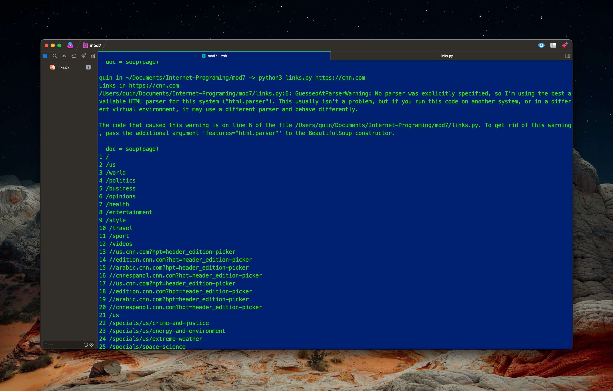

# Module 7

## Quindarius Lyles-Woods



# Report

Installing the package request and beautiful soup allowed me to run a web scraper on any site that I use the command-line to output.

## Code for the scraper

```python
def get_links(url):
	import requests
	from bs4 import BeautifulSoup as soup
	result = requests.get(url)
	page = result.text
	doc = soup(page)
	links = [element.get('href') for element in doc.find_all('a')]
	return links

if __name__ == '__main__':
	import sys
	for url in sys.argv[1:]:
		print('Links in', url)
		for num, link in enumerate(get_links(url), start=1):
			print(num, link)
		print()

```
